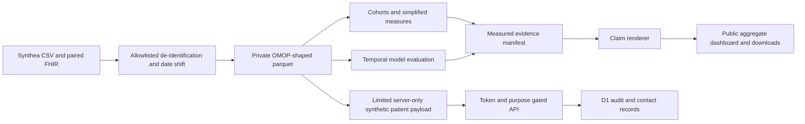

# Architecture

Rounds is a batch analytical demonstration on generated Synthea records.

The warehouse uses recognizable OMOP table and field names so the clinical concepts and cohort SQL remain inspectable. This release does not certify a complete OMOP CDM implementation: source codes are not a licensed Athena vocabulary, and the table set and fields are deliberately scoped. Portable SQL and familiar clinical entities motivate the structure, not a claim of compatibility that has not been tested.

The website is React on Vinext, compiled into a Cloudflare Worker plus static assets. Sites manages deployment and a logical D1 binding. The public bundle includes aggregates only. DuckDB-WASM loads aggregate tables into a browser-local database; a public parquet file containing patient rows is never used as an authentication substitute.

Private-site identity comes from the hosting gateway. A short-lived random bearer token is stored only as a hash in D1; the browser keeps its token in memory. Patient views require a purpose. Each returned person has an audit row written and read back before the response is constructed. Audit failures withhold payloads. Contact writes and their audit row share one D1 batch.

Model scoring reconstructs fitted standardized linear models. Binary probabilities include the separately fitted calibration sigmoid; length of stay uses the fitted log transform and calibration-residual interval. Explanations are exact linear contributions, not SHAP or causal effects. The original-calendar ED forecast operates at system level. Unavailable NEWS2 inputs are never filled with normal values.

The exact source and public artifact boundaries are enforced by release tests. No real patient record is accepted or published. UCI records are used locally for a separately retrained benchmark, and only its aggregate evaluation is published.
